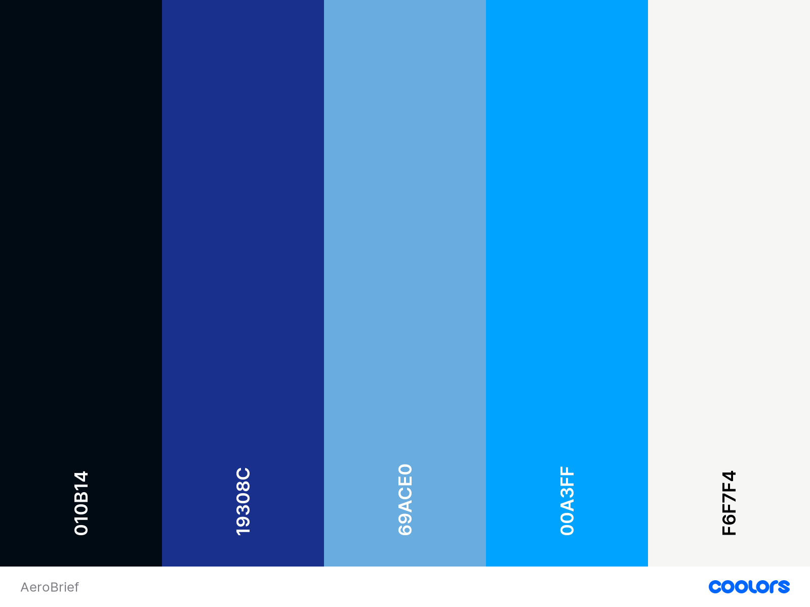
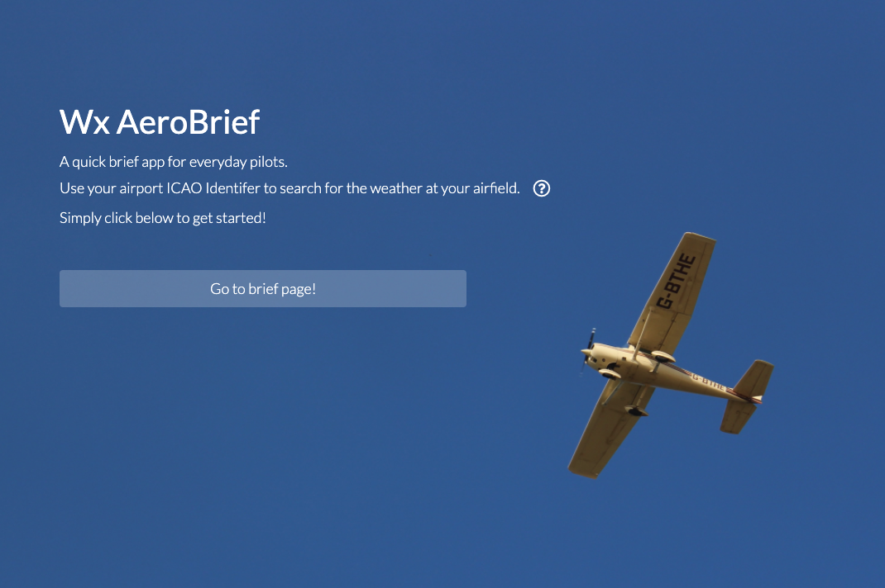
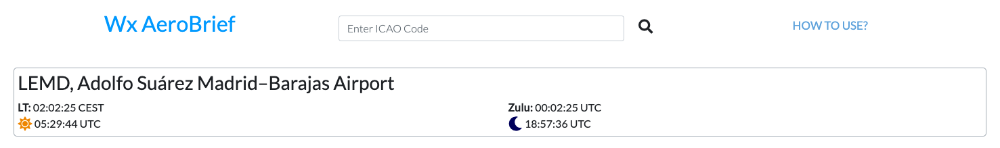
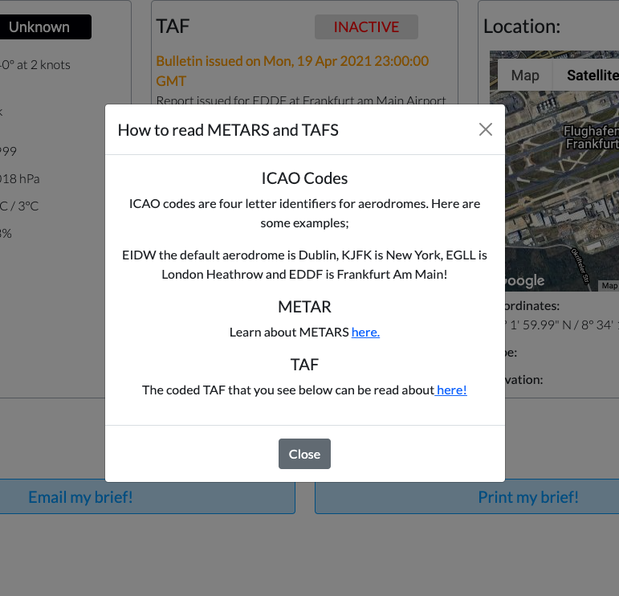
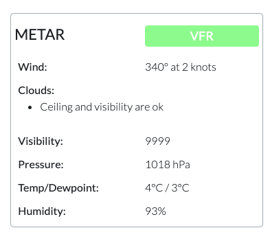
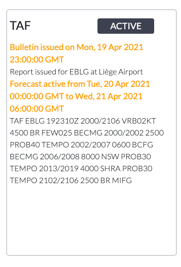
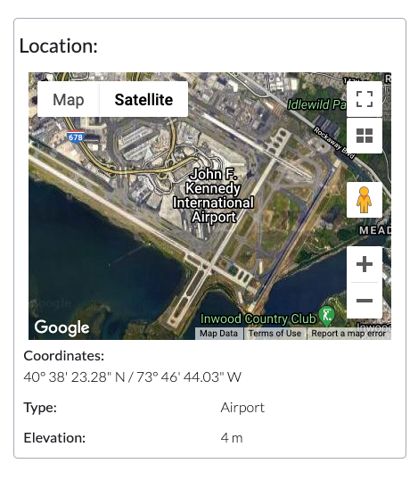
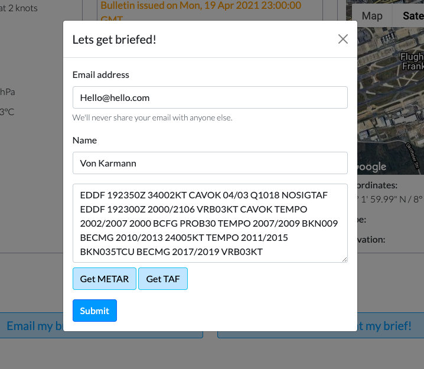

# **Wx AeroBrief**

## **[View the Live Website Here!]()** ##

## **Code Institute Milestone 2 Project - Interactive Frontend Development**

The project has been undertaken to build an efficient and simple weather briefing website for pilots. The site is named "Wx AeroBrief", where 'WX' is an abbreviation fo weather. The site aims to be a contrast to other aviation weather sites, where the content can be overwhelming and the user-interface outdated.

The site is broken down into two pages, the landing page and the briefing page. Both pages aim to intice the user to utilise the functions provided and display a professional but approachable user interface. The pages also cater for a user who may not be familiar with aviation terminology and therefore enables the user to learn more. 

Overall, the websites purpose is present the critical information needed for a weather brief in simple and digestable format.

# Table of Contents:

- [**UX**](#ux)
  * [User Stories](#user-stories)
  * [Strategy](#strategy)
  * [Scope](#scope)
  * [Structure](#structure)
  * [Skeleton](#skeleton)
    + [**Wireframes**](#--wireframes--)
    + [**Changes to initial wireframes**](#--changes-to-initial-wireframes--)
  * [Surface](#surface)
- [**Features**](#features)
  * [1. Navigation](#1-navigation)
  * [2. Landing Page](#2-landing-page)
  * [3. Our Services](#3-our-services)
  * [4. Our Renewable Technology](#4-our-renewable-technology)
  * [5. About us / Meet the team](#5-about-us---meet-the-team)
  * [6. Get in touch](#6-get-in-touch)
  * [7. Future Features](#7-future-features)
- [**Technologies**](#technologies-used)
  * [Languages](#languages)
  * [Libraries, Frameworks and Technologies](#libraries--frameworks-and-technologies)
  * [Workspace and Version Control](#workspace-and-version-control)
- [**Testing**](#testing)
  * [Code Validators](#code-validators)
  * [Responsive Elements](#responsive-elements)
  * [UX User Story Test](#ux-user-story-test)
  * [Manual Testing](#manual-testing)
  * [Bugs and Fixes](#bugs-and-fixes)
- [**Deployment**](#deployment)
  * [Github Pages Deployment:](#github-pages-deployment-)
  * [Forking The Repository:](#forking-the-repository-)
  * [Creating a local clone:](#creating-a-local-clone-)
- [**Credits**](#credits)
  * [Content](#content)
  * [Media](#media)
  * [Acknowledgements](#acknowledgements)

# **UX**
## User Stories
----------------
In this project there are three main groups of target users. They include professional pilots, training students and casual general users. The user stories for each group are defined below.

__Applicable to all users__
- As a user, I would like to understand the purpose of the website on landing on the page.
- As a user, I would like to get the information I require quickly and effectively.
- As a user, I require the information in standard industry format. ie in METAR and TAF.
- As a user, I need to be able to search for my relevant airfield.
- As a user, I would like to see additional data such as the location, to gain a greater situational awareness.
- As a user, the ability to email or print my brief is important.

__Professional Pilots__
- As a professional pilot, the ability to see the weather forecast is vital to safe operation of my flight.
- As a professional pilot, additional information about my airfield is important.
- As a professional pilot, I require information for a specific reporting point and not necessarily for a large region.

__Training and Students__
- As a student, I would like the ability to learn more about weather reports and standard industry practice.
- As a student, I am not as proficient in flying and require a set of rules to go flying. Knowing that condtions are safe for me to fly is vital.
- As a student, simple and disgestable content would be effective in my learning application.

__General user__
- As a general user, I do not need overwhelming amounts of content or and do not want to research how to read the weather.

__Returning Users__
- As a returning user, I would like to be able to quickly navigate to the briefing page.

## Strategy
----------------
__Project goals__

The aim of this project is present aviation weather briefing information in a simple and clear but professional way. It was important to create a user-friendly and approachable site with a modern design and feel. The critical data had to be presented to the user in a way that they are familar with. This in-effect makes the site very accessible to people who understand the industry and the standard operating procedures. 

The content of the site therefore had to include;
- ICAO designated airfield weather reporting.
- METAR - Meteorological Terminal Air Report in decoded or coded format.
- TAF - Terminal Aerodrome Forecast in coded form.

Additionally content that may be of use is;
- The location by latitude and longitude.
- An area map.

__User goals__ 

The user goals will be met by enabling the user get access to the required data in a clear and concise format. The users require key data and an efficient user experience. The users goals will be achieved through a basic structure that divides the data into easily disgestable sections and enables the user to gain only they information they require. 

The ensure the user needs are met the site will be a simple landing page and then briefing page in the style of a dashboard of information. 

__Research__

Through prior experience with aviation weather briefing websites and apps, I had an understanding that there is a significant gap in the market for a user-friendly and simple briefing site. Most aviation weather apps are difficult to use, their design is outdated and the key information can be buried in content. Therefore a priority in the design of the site is simplicity and an efficent user-experience. A modern and light design combined with key data for the user makes the site stand out compared to the apps that were researched. 

## Scope 
----------------
Based on the strategy of the project, a number key requirements were laid out. The site is built for purpose and the data should be reliable and accurate as possible. The scope therefore includes:
- A landing page detailing what parameter will be needed to use the site. ie the ICAO code.
- A section detailing what an ICAO code is and some examples for users who are not familiar. However, it should be noted that an aviation professional or student would know their relevant ICAO code.
- A section for a decoded METAR, displaying key wind, clouds, pressure, temperature and conditions.
- A section for a TAF, showing the relevant forecast window and the coded TAF forecast.
- An interactive satellite map of the aerodrome.
- The aerodrome co-ordinates and elevation above sea level.
- Form for emailing that is fully functional.
- Print function to enable the user to print directly from browser.
- A search bar to input any relevant ICAO code.
- A popover that enables the user to learn more about METARS and TAFS.

## Structure
----------------

The structure of the page is formed around a landing page that links directly to briefing dashboard.
The briefing page is split into a five sections. The top-line search bar and pop-down, the airport information section, the METAR, TAF and location section and finally the email and print buttons. The site is responsive and is fully functional. 

1. **Landing Page**
- Simple landing page, with solid block colour hero-image featuring an aircraft. The content features a simple plain white text and description of the site and what required parameter is needed. The landing page features a button that links directly to the briefing dashboard. 
2. **Briefing Page**
- This section is the key dashboard that enables the user to search for their weather briefing. It is split into key containers. The airport information section displays the users search result along with the formal name of the aerodrome, the local time, zulu time and the sunset and sunrise hours.
- The METAR container displays decoded weather information up to the latest report along with an interactive feature that changes colour depending of the weather restrictons at the aerodrome.
- The TAF container shows a coded format of the forecast with the relevant timestamps.
- The location area features a Google Maps satellite image of the aerodrome along with details of the aerodrome.
- The email button links to a modal that enables the user to receive the brief by email. The print button opens the print function of the browser and allows the user print the raw data brief. 
3. **Information Architecture**

## Skeleton 
----------------
### **Wireframes** ###

The Skeleton of the project design was built utilising [Figma](https://www.figma.com/design-systems/). 
A detailed design breakdown can be seen [here.]()
The overall basic design breakpoints can be seen below:

The individual wireframes can be seen by following the links below:
- [xs]()
- [sm]()
- [md]()
- [lg]()
- [xl]()

### **Changes to initial wireframes** ###
A number of design edits were made throughout the project with the purpose of increased userability. 
 

## Surface 
----------------
The site aimed to be bright, clear and simple. The colour choice was to be light so that nothing distracts from the key data and information. The colour blue is associated with the sky and therefore a theme of blue and white was pursued. A white background enabled the vital data to be displayed immediately, along with a clear contrast for different flight conditions.

**Colour Theme**

**Typography**

- The font used for both body and headings is [Lato
Designed by Łukasz Dziedzic](https://fonts.google.com/specimen/Lato). This font was chosen for its professionalism and clarity.
I wanted to bring a modern design feel to the site and utilising a font that is widely used was effective.
The site also has 'Sans Serif' as an alternative font.

# **Features**
----------------
## 1. Landing Page
-----------------
The landing page features high-quality large solid block image with an aircraft flying overhead. The user aware that the site is relevant for aviation users. The title of the site is large, bold and contrasts well with sky colours in the background.

The text underneath the title lays out what the purpose of the site is. It also explains to the user that they require the ICAO identifier for their aerodrome. The user also has the oppurtunity to engage with a pop-over that explains what the ICAO code is and also gives some examples for users that are not familiar with aviation terminology.

The user is then presented with a large button that links to the briefing page.

----------------------
## 2. Briefing Page
----------------------
The Briefing page opens on the default EIDW or Dublin Airport. The user is prompted to enter their ICAO code in the search bar. The return result shows the airport name and the relevant times. The title links back to the landing page for userability.

The 'How to use" opens a modal that enables the user to learn more about the relevant terminology. The modal also reiterates what an ICAO code is and shows some examples for unfamiliar users. The site links to relevant pages for further reading. 

__METAR Section__

The key element of the brief dashboard is the decoded METAR briefing. It displays vital weather information relevant for the user in a clear and concise way. The section features a interactive label that changes colour relevant to the weather conditions at the aerodrome. The data is broken down into manageable sections, featuring a cloud and condition list. 

The data labels are chosen in levels of importance as per industry standards. The data also features standard format. For example, visiblility 9999 illustrates that the visibility is greater than 10km. 

__TAF Section__

The TAF section features key forecast data in coded format. The reason for coded format is answered in the user stories section below. The section features a label which can show active or inactive. If the TAF is inactive, the label shows red text and alerts the user that the data may be out of date or innaccurate. That is a key functionality for the user to be able to quickly understand whether the information should be trusted or not. 

The TAF section displays the time and date the forecast was issued and also shows the period of time that the TAF is active for.

__Location Section__

The location section displays an interactive google map with satellite imagery of the aerodrome, along with the coordinates, the airport type and elevation above mean sea level. This is additional information and not one of the two key datasets, however it adds to the user experience and is a bonus element for understanding and briefing. 

__Email and Print Section__

The email modal displayed below allows the user to select a METAR or TAF to email directly to themsleves. This key functionality enables the user a seemless way of getting the key information required in different formats. The print function opens the browsers printing application and enables the user to print off the raw format METAR and TAF. 

## 3. Future Features
Future features that could be implemented include:
- A nearby aerodrome locator.
- Specific airport brief detailing runway details and air traffic control frequencies.
- An overlayed map showing route options.
- A point to point briefing, showing weather along the route.

I believe that given my limited knowledge of languages used and the given scope of the project, it was justified to not pursue implementing the aforementioned features.

# **Technologies**
## Languages
---------------
For this project two languages were used:
- [HTML](https://www.w3schools.com/html/#:~:text=HTML%20is%20the%20standard%20markup,learn%20%2D%20You%20will%20enjoy%20it!)
- [CSS](https://www.w3schools.com/css/)
- [Javascript](https://www.javascript.com/)

## Libraries, Frameworks and Technologies
---------------

- [Check WX API](https://www.checkwxapi.com/) - Used to source all weather and aerodrome data.

- [Bootstrap](https://getbootstrap.com/) - Bootstrap was used to for its wasy to use grid and repsonsive layout. Elelments of the navbar, cards and forms were taken from the Bootstrap V5.0 CDN.

- [Figma](https://www.figma.com/) - Figma was used to create initial design and wireframes for different breakpoints.

- [Coolors](https://coolors.co) - Used to create colour palette and test colour themes.

- [Unsplash](https://unsplash.com/) - Used to source high quality images.

- [Google Fonts](https://fonts.google.com/) - Google font 'Lato' was included in the project.

- [Font Awesome](https://fontawesome.com/) - All icons used throughout the project come from fontawesome.

- [JQuery](https://jquery.com/) - Used for aspects of userability.

- [Google Maps API](https://developers.google.com/maps) - Used to build google maps view.

- [EmailJS](https://www.emailjs.com/) - Used for email functionality.

- [Mock-Up Generator](https://techsini.com/multi-mockup/index.php) - Used for title photo.

## Workspace and Version Control
--------------------
- [Github](https://github.com/) - The project is hosted on Github and the live website is worked through Github pages.

- [Gitpod](https://www.gitpod.io/) - The project used Gitpod IDE for build and development. 

# **Testing**
## Code Validators 
---------------
A number of code validation techniques were utilised to ensure proper testing of site. 
For HTML and CSS, I used the [W3C Markup Validator](https://validator.w3.org) and [W3C CSS Validation Services](https://jigsaw.w3.org/css-validator/). 
These tests returned no errors. See below for results.

- [HTML Test]()
- [CSS Test]()

A Chrome Developer Tools "Lighthouse" Test was aslo completed to test for accessibility and performance. 
The results are seen below. Initial testing showed a low value of SEO and accessibility. This was rectified by 
adding missing alt labels and adding a meta description. Although, the accessibility number is still below 90,
this is an area I wish to improve on going forward with the design of the site. 

## Responsive Elements 
--------------

The responsivity of the page was tested primarily using [Google Chrome Dev Tools]() and manual resizing of windows. The test provided positive results for each 
device option. The responsive breakpoints and resizing worked throughout the site. The site was shared with colleagues and friends and tested 
on their devices. An error on IOS with images was found through these tests. A fix for that problem is referred to in the relevant section below.

Other tools utilised to test responsivity are seen here:
- [Screenfly](https://bluetree.ai/screenfly/) - [Result]()
- [Responsinator](http://www.responsinator.com) - [Result]()
  

## UX User Story Test
--------------
The user stories previously laid out in the UX Design section are tested, to ensure that project achieves the user goals.

__Applicable to all users__
- As a user, I would like to understand the purpose of the website on landing on the page.
- As a user, I would like to get the information I require quickly and effectively.
- As a user, I require the information in standard industry format. ie in METAR and TAF.
- As a user, I need to be able to search for my relevant airfield.
- As a user, I would like to see additional data such as the location, to gain a greater situational awareness.
- As a user, the ability to email or print my brief is important.

__Professional Pilots__
- As a professional pilot, the ability to see the weather forecast is vital to safe operation of my flight.
- As a professional pilot, additional information about my airfield is important.
- As a professional pilot, I require information for a specific reporting point and not necessarily for a large region.

__Training and Students__
- As a student, I would like the ability to learn more about weather reports and standard industry practice.
- As a student, I am not as proficient in flying and require a set of rules to go flying. Knowing that condtions are safe for me to fly is vital.
- As a student, simple and disgestable content would be effective in my learning application.

__General user__
- As a general user, I do not need overwhelming amounts of content or and do not want to research how to read the weather.

__Returning Users__
- As a returning user, I would like to be able to quickly navigate to the briefing page.

## Manual Testing
--------------
**Browser testing** 

**Functionality testing**

## Bugs and Fixes 
--------------

# Deployment 

## Github Pages Deployment:

## Forking The Repository:

## Creating a local clone:

# **Credits**
## Content
--------------
 
## Media 
--------------

## Acknowledgements
--------------
Thanks to my family and friends who devoted their time to test the page and proof-read over text. 
Thanks to the [Code Institute](https://codeinstitute.net) for the tutorials and resources. 
Thanks again to my mentor [Oluwafemi Medale](https://github.com/omedale) for valuable insight and support. 